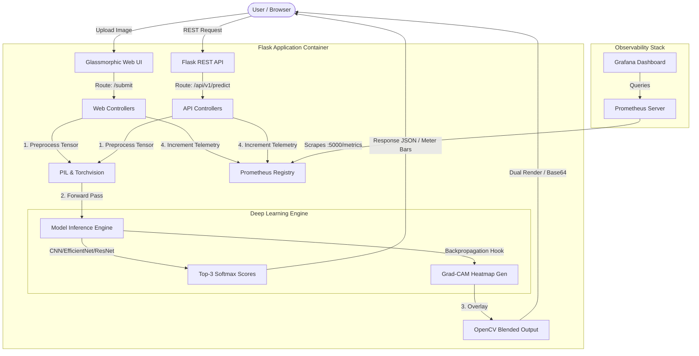

# 🍀 LeafAI: Production-Grade Crop Disease Diagnostics System

[](https://github.com/yourusername/Crop-Disease-Detection/actions/workflows/ci-cd.yml)
[](https://hub.docker.com/)
[](https://www.python.org/)
[](https://opensource.org/licenses/MIT)

LeafAI is an enterprise-level deep learning and MLOps portfolio application that transforms crop pathology diagnostics. By leveraging fine-tuned Convolutional Neural Networks (CNNs) alongside Class Activation Maps (Grad-CAM), the application provides both high-confidence classification predictions and explainable visual evidence of diseased leaf tissue regions.

The system is instrumented with full Prometheus telemetry for MLOps observability, structured in a standard Python/Flask blueprint architecture, containerized with Docker, and automated via GitHub Actions.

---

## 🏗️ System Architecture

The following diagram illustrates the lifecycle of a request through the LeafAI stack:



---

## 🚀 Key Technical Enhancements

1. **Transfer Learning Upgrades**: Replaced baseline customized CNN architectures with state-of-the-art **EfficientNet-B0** and **ResNet50** backbones fine-tuned on the PlantVillage dataset (61,000+ crop leaf images across 39 classes).
2. **Explainable AI (XAI)**: Integrated a custom **Grad-CAM** gradient extractor that hooks into the final convolutional layer of models to overlay heatmaps highlighting specific visual anomalies.
3. **Telemetry & Instrumentation**: Exposed `/metrics` to Prometheus via `prometheus-client` tracking inference count, errors, and millisecond latency histograms.
4. **Modern UI Redesign**: Developed a responsive, glassmorphic client interface supporting drag-and-drop file inputs, real-time file validations, and loading animations.
5. **CI/CD Pipeline**: Added GitHub Actions configured for automatic syntax linting, python unit testing (`pytest`), and Docker hub build/push operations.

---

## 📁 Repository Structure

Following production conventions, the repository is organized as follows:

```
Crop-Disease-Detection/
├── .github/
│   └── workflows/
│       └── ci-cd.yml            # CI lint/test and Docker CD pipeline
├── src/
│   ├── app/
│   │   ├── __init__.py
│   │   ├── main.py              # Server entry point & configuration manager
│   │   ├── monitoring.py        # Prometheus telemetry registry definitions
│   │   └── routes/
│   │       ├── api.py           # REST Controllers
│   │       └── web.py           # User-facing HTML Controllers
│   ├── model/
│   │   ├── __init__.py
│   │   ├── cnn.py               # Custom CNN architecture
│   │   ├── transfer.py          # ResNet50 & EfficientNet models & loading factory
│   │   └── gradcam.py           # Grad-CAM hook engines & OpenCV image blending
│   └── train.py                 # Fine-tuning & evaluation execution scripts
├── templates/                   # Frontend Jinja templates
├── static/                      # Static client assets (styles, javascripts, uploads)
├── tests/                       # Automated Pytest suite
│   ├── __init__.py
│   └── test_api.py
├── Dockerfile                   # Multi-stage production Docker definition
├── docker-compose.yml           # Orchestration compose (App + Prometheus)
├── prometheus.yml               # Prometheus server config definitions
├── requirements.txt             # Direct and transitive application dependencies
└── README.md                    # Detailed documentation
```

---

## 🛠️ Local Development & Setup

### Prerequisites
* Python 3.10 or higher
* Docker & Docker Compose (optional)

### Setup Virtual Environment
1. Clone the repository:
   ```bash
   git clone https://github.com/yourusername/Crop-Disease-Detection.git
   cd Crop-Disease-Detection
   ```
2. Create and activate a virtual environment:
   ```bash
   python -m venv venv
   # On Windows:
   venv\Scripts\activate
   # On macOS/Linux:
   source venv/bin/activate
   ```
3. Install dependencies:
   ```bash
   pip install -r requirements.txt
   ```

### Execution
* Run the Flask web application locally:
  ```bash
  python src/app/main.py
  ```
  The app will start at `http://localhost:5000`.

* Run the unit test suite:
  ```bash
  pytest
  ```

---

## 🐳 Docker Deployment (Recommended)

To run the full stack including the Flask application and Prometheus metrics scraper locally in containers:

1. Build and run containers using Docker Compose:
   ```bash
   docker-compose up --build
   ```
2. Access the portals:
   * **Web application**: `http://localhost:5000`
   * **Prometheus telemetry portal**: `http://localhost:9090`

---

## 📊 Observability & Monitoring

### Exposed Prometheus Metrics
The server exports the following metrics on `/metrics`:
* `plant_disease_predictions_total{disease_name="...", status="..."}`: Incremental counter of predictions.
* `plant_disease_prediction_latency_seconds_bucket`: Latency histogram of inference execution times.
* `plant_disease_uptime_seconds`: Gauge reporting elapsed runtime uptime.
* `plant_disease_prediction_errors_total{error_type="..."}`: Error occurrence counters.

### Recommended Grafana Dashboard Config
For professional monitoring, hook Grafana to Prometheus and display:
1. **Prediction Success Rate**: Gauge query `sum(rate(plant_disease_predictions_total{status="success"}[5m])) / sum(rate(plant_disease_predictions_total[5m]))`
2. **Inference Latency (p95)**: Graph query `histogram_quantile(0.95, sum(rate(plant_disease_prediction_latency_seconds_bucket[5m])) by (le))`
3. **Application Uptime**: Value card query `plant_disease_uptime_seconds`
4. **Error Rates**: Graph panel query `sum(rate(plant_disease_prediction_errors_total[5m])) by (error_type)`

---

## 🔌 API Documentation

### 1. Health Status check
* **Endpoint**: `GET /api/v1/health`
* **Response `200 OK`**:
  ```json
  {
    "status": "healthy",
    "model": {
      "name": "efficientnet_b0",
      "status": "loaded"
    },
    "timestamp": 1781298492.12
  }
  ```

### 2. Run Diagnostic Inference
* **Endpoint**: `POST /api/v1/predict`
* **Content-Type**: `multipart/form-data`
* **Request Body**:
  * `image`: Binary file (JPEG/PNG/WebP representing a leaf sample)
* **Response `200 OK`**:
  ```json
  {
    "prediction": {
      "class_id": 2,
      "confidence": 0.942,
      "disease_name": "Apple___Cedar_apple_rust",
      "description": "Cedar apple rust is a fungal disease that requires both apple trees and red cedars...",
      "prevention": "Prune out galls on cedars; Apply fungicides starting at blossom time...",
      "image_url": "https://..."
    },
    "top_predictions": [
      { "rank": 1, "class_id": 2, "disease_name": "Apple___Cedar_apple_rust", "confidence": 0.942 },
      { "rank": 2, "class_id": 0, "disease_name": "Apple___Apple_scab", "confidence": 0.041 },
      { "rank": 3, "class_id": 3, "disease_name": "Apple___healthy", "confidence": 0.017 }
    ],
    "supplement": {
      "name": "Liquid Copper Fungicide Spray",
      "image_url": "https://...",
      "buy_link": "https://..."
    },
    "gradcam_image_base64": "data:image/jpeg;base64,/9j/4AAQSkZJRgABAQEASABIAAD...",
    "gradcam_url": "/static/uploads/gradcam_1680123_leaf.jpg",
    "latency_seconds": 0.142
  }
  ```

### 3. Retrieve Disease Metadata
* **Endpoint**: `GET /api/v1/diseases`
* **Response `200 OK`**:
  ```json
  {
    "diseases": [
      {
        "class_id": 0,
        "disease_name": "Apple___Apple_scab",
        "description": "Fungal infection caused by Venturia inaequalis...",
        "possible_steps": "Remove fallen leaves in autumn; apply sulfur spray...",
        "image_url": "https://..."
      }
    ]
  }
  ```

---

## 🌍 Cloud Deployment Options

### Hugging Face Spaces (Docker SDK)
1. Select **Create New Space** on Hugging Face.
2. Select **Docker** SDK and choose the **Blank** template.
3. Push this repository's code to the Hugging Face space Git remote.
4. Hugging Face will automatically parse the `Dockerfile` and boot the service on port 7860 (it will automatically expose standard ports).

### Render
1. Connect your GitHub repository to [Render](https://render.com).
2. Choose **Web Service**.
3. Select **Docker** environment runtime.
4. Configure environment variables in the console (`MODEL_NAME=efficientnet_b0`).
5. Render will automatically build the multi-stage docker container and deploy it.

### Railway
1. Sign up on [Railway.app](https://railway.app).
2. Click **New Project** and connect your GitHub repository.
3. Railway automatically detects the `Dockerfile` and provisions a public url.

---

## 🔮 Future Enhancements
* **TensorRT/ONNX Optimization**: Convert PyTorch models to ONNX to lower inference latency under heavy concurrent request batches.
* **Edge Diagnostics**: Package the PyTorch models into CoreML/TFLite models to support offline, client-side leaf predictions on mobile devices.
* **Semantic Segmentation**: Integrate Segment Anything Model (SAM) to isolate the leaf body before sending images to the classifier to improve accuracy.
